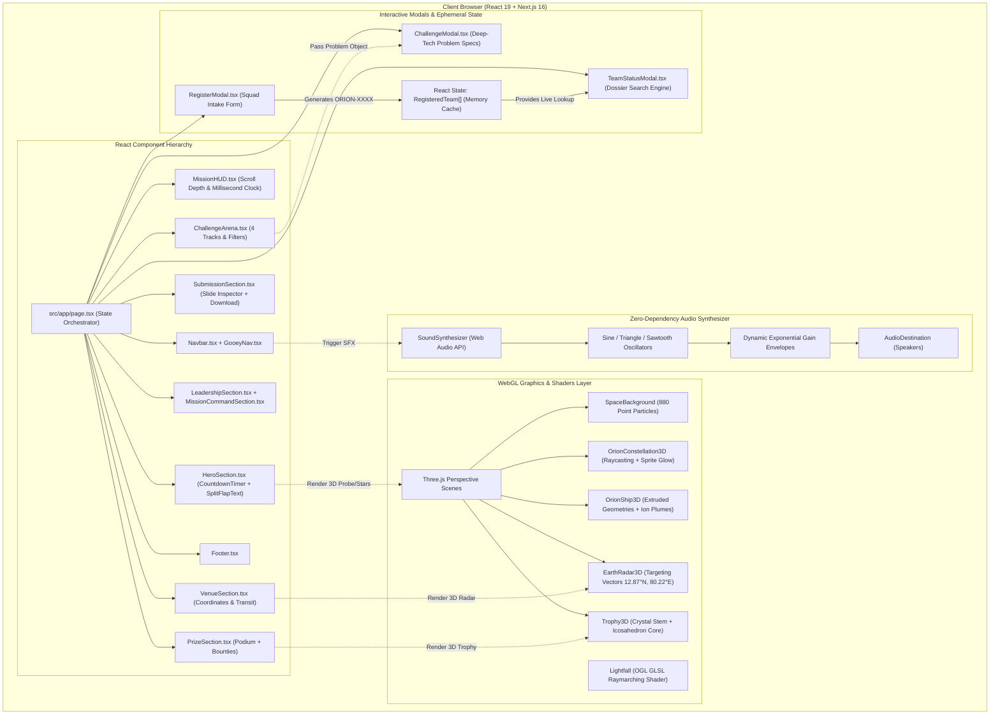

# ORION 1.0 — 24H National Hackathon Command Portal
### Microsoft Club SIST • Sathyabama Institute of Science and Technology, Chennai

[](https://nextjs.org/)
[](https://react.dev/)
[](https://www.typescriptlang.org/)
[](https://tailwindcss.com/)
[](https://threejs.org/)
[](LICENSE)

---

## 1. Executive Overview

**ORION 1.0** is an interactive, aerospace-themed mission telemetry dashboard and web platform for a nationwide 24-hour national hackathon organized by **Microsoft Club SIST** at the **Sathyabama Institute of Science and Technology (SIST)** in Chennai, India.

It delivers a cinematic command-center experience featuring 3D WebGL visualizations, real-time procedural audio synthesis, mechanical departure boards, interactive problem dossier viewers, and live squad registration/status tracking.

* **Prize Pool**: **₹1,00,000** total cash rewards, merit bounties, and incubation grants.
* **Selection Protocol**: 2-Phase Selection (Round 1: ₹100 flat online qualifier; Round 2: ₹200/head for Top 70 offline finalists).
* **Venue**: School of Computing Complex, Sathyabama Institute of Science and Technology (OMR, Chennai).
* **Target Audience**: Pan-India computing and engineering students (UG, PG, PhD) and early-career builders forming multidisciplinary squads of 2 to 6 members.

---

## 2. System Architecture

ORION 1.0 is engineered as a **Client-Centric, Component-Driven Single Page Application (SPA)** built on Next.js 16 App Router. It combines 3D WebGL render loops, GLSL canvas shaders, procedural audio oscillators, and responsive DOM components with zero heavy external media assets.



---

## 3. Technology Stack

| Technology Category | Technology Name | Exact Version | Purpose & Implementation Details |
| :--- | :--- | :--- | :--- |
| **Framework** | **Next.js (App Router)** | `16.3.1` | Root routing, Turbopack compilation, metadata, static generation |
| **UI Library** | **React / React DOM** | `19.2.8` | Client component trees, state hooks, and custom refs |
| **Language** | **TypeScript** | `^5.0.0` | Strict type definitions across data models and 3D scenes |
| **Styling & CSS** | **Tailwind CSS** | `^4.0.0` | `@tailwindcss/postcss` with Frost-to-Cobalt cybernetic design tokens |
| **3D Graphics** | **Three.js** | `^0.185.1` | Constellation, Space Probe, Geospatial Radar, and Trophy renderers |
| **Shader Engine** | **OGL** | `^1.0.11` | Minimal WebGL library for raymarched GLSL Lightfall background shader |
| **Audio Engine** | **Web Audio API** | Native Browser API | Zero-dependency synthesized audio engine with mobile touch auto-unlock |
| **Iconography** | **Lucide React** | `^1.31.0` | Aerospace, HUD, and cybernetic vector iconography |
| **Visual FX** | **canvas-confetti** | `^1.9.4` | Celebratory particle explosions upon registration and download |
| **Typography** | **Google Fonts CDN** | Cloud Delivery | Space Grotesk (Headings), JetBrains Mono (HUD), Inter (Body) |

---

## 4. Key Features

### 4.1 Interactive 3D WebGL Holograms
* **Orion Constellation Viewport**: Real-time 3D constellation with clickable star nodes (Betelgeuse, Rigel, Bellatrix, etc.) displaying apparent magnitude and light-year distances via `THREE.Raycaster`.
* **Explorer Spacecraft Probe**: Procedurally extruded aerospace probe with pulsating ion thruster plumes and rotating sensor gimbals.
* **Geospatial Radar Globe**: Wireframe Earth globe locked onto Chennai coordinates ($12.8718^\circ\text{ N}, 80.2206^\circ\text{ E}$) with spherical vector projection.
* **Grand Champion 3D Trophy**: Holographic aerospace award model with interactive rotation and inspect prompts.

### 4.2 Web Audio Procedural Synthesizer
* Zero audio files downloaded over the network.
* Pure mathematical waveforms (sine, triangle, sawtooth) modulated with exponential gain decay curves.
* Micro-pitch hover chirps, modal chord transitions, warp-drive swooshes, and celebratory ascending fanfares.
* Cross-browser touch unlock on mobile devices.

### 4.3 Two-Tier Selection Protocol & Transparent Fees
1. **Round 1 (Online Qualifier)**: Flat **₹100** registration fee per team regardless of squad size (2 to 6 builders). Closes **September 18, 2026**.
2. **Round 2 (Offline Grand Finale)**: **₹200** per head confirmation fee for shortlisted **Top 70 finalist squads** for the 24-hour sprint at SIST Chennai, covering:
   * 2 Breakfasts, 2 Lunches, 1 Grand Dinner & midnight booster snacks.
   * Free on-campus hostel accommodation for outstation teams.
   * Official ORION 1.0 Swag Kits (tees, stickers, badges, lanyards).
   * 24/7 high-speed LAN, air-conditioned computing labs, and uninterrupted power backup.

### 4.4 Standardized 5-Slide Presentation Blueprint
All Round 1 entries must strictly follow the mandatory 5-slide blueprint:
* **Slide 01**: Mission Title, Squad Roster & Problem Track Code.
* **Slide 02**: Problem Deconstruction, Existing Limitations & Solution Novelty.
* **Slide 03**: Technical System Architecture, Data Flow & Block Diagrams.
* **Slide 04**: Implementation Roadmap, Completed Modules & Offline Sprint Plan.
* **Slide 05**: Real-World Impact, Commercial Feasibility & Threat Model.

*Includes interactive slide-by-slide inspector and one-click template downloader with confetti celebration.*

### 4.5 Squad Registration & Verification Engine
* **Live Registration Intake**: Validates team roster metadata, assigns a unique mission code (`ORION-XXXX`), updates local state cache, and triggers victory fanfare.
* **Mission Verification Search**: Search by Team ID, team name, or leader email with sample ID quick-pills (`ORION-9012`, `ORION-8421`, `ORION-6590`) and instant status indicators.

---

## 5. Flagship Problem Statements

```
+-----------------------------------------------------------------------------------+
|                            ORION 1.0 CHALLENGE ARENA                              |
+-----------------------------------------+-----------------------------------------+
                                          |
        +---------------------------------+---------------------------------+
        |                                 |                                 |
+-------v-------+                 +-------v-------+                 +-------v-------+
|  ORION-PS-01  |                 |  ORION-PS-02  |                 |  ORION-PS-03  |
|   FLOATCHAT   |                 |   LEXVAULT    |                 |  SYLVASENSE   |
+---------------+                 +---------------+                 +---------------+
| Ocean Informatics               | Applied Cryptography            | Earth Observation
| FastFloat + NetCDF RAG          | Circom + ZK-SNARKs              | PyTorch + YOLOv8-OBB
| Multi-Modal Ocean LLM           | Zero-Knowledge Evidence         | SAR Canopy Counting
+---------------+                 +---------------+                 +---------------+
```

* **ORION-PS-01: FLOATCHAT (Ocean Informatics & Geospatial AI)**: Natural language to NetCDF query engine with 4D spatio-temporal WebGL trajectories for ARGO profiling float telemetry (temperature, salinity, geochemistry to 2000m depth).
* **ORION-PS-02: LEXVAULT (Applied Cryptography & LegalTech)**: Zero-Knowledge (ZK-SNARK / ZK-STARK) digital evidence depository maintaining tamper-evident forensic chains of custody on decentralized ledgers with zero content leakage.
* **ORION-PS-03: SYLVASENSE (Earth Observation & Forestry Vision)**: Multi-spectral optical (Sentinel-2) and Synthetic Aperture Radar (Sentinel-1 SAR) computer vision pipeline for canopy segmentation and Aboveground Biomass (AGB) regression.
* **ORION-PS-04: OPEN INNOVATION TRACK**: Novel solutions across Generative AI, Web3, Cybersecurity, Robotics/IoT, Healthcare, and Space Tech.

---

## 6. Repository File Map

```
orion-1.0/
├── README.md                            # Comprehensive project overview, architecture & setup guide
├── AGENTS.md                            # Next.js workspace agent rule file
├── LICENSE                              # MIT Open Source License
├── package.json                         # Next.js 16, React 19, Three.js, Tailwind v4 manifests
├── package-lock.json                    # Deterministic NPM dependency lockfile
├── next.config.ts                       # Next.js application configuration file
├── tsconfig.json                        # Strict TypeScript compiler configuration
├── postcss.config.mjs                   # PostCSS configuration with Tailwind v4 plugin
├── eslint.config.mjs                    # ESLint 9 flat configuration with Core Web Vitals
├── public/                              # Static vectors, icons, and SVG assets
│   ├── favicon.svg                      # Custom constellation mission SVG favicon
│   ├── file.svg                         # Document icon asset
│   ├── globe.svg                        # Globe vector icon
│   └── vercel.svg                       # Vercel deployment icon
└── src/
    ├── app/
    │   ├── globals.css                  # Design tokens, cybernetic utilities, HUD styles
    │   ├── layout.tsx                   # HTML head, metadata, OpenGraph, font preconnects
    │   └── page.tsx                     # Main client orchestrator, state manager, section assembler
    ├── audio/
    │   └── soundEffects.ts              # Zero-dependency Web Audio API sound synthesizer class
    ├── components/
    │   ├── 3d/                          # Interactive Three.js WebGL scenes
    │   │   ├── EarthRadar3D.tsx         # Geospatial globe with Chennai beacon coordinates
    │   │   ├── OrionConstellation3D.tsx # Interactive constellation with star hover raycasting
    │   │   ├── OrionShip3D.tsx          # Procedural 3D spacecraft with ion engine plumes
    │   │   ├── SpaceBackground.tsx      # Smooth-scrolling particle starfield background
    │   │   └── Trophy3D.tsx             # 3D Grand Champion aerospace trophy hologram
    │   ├── common/                      # Cybernetic reusable UI components
    │   │   ├── AnimatedCounter.tsx      # Smooth numerical roll counter on scroll
    │   │   ├── ClickSpark.tsx           # HTML5 2D Canvas click particle burst
    │   │   ├── CountdownTimer.tsx       # Live synchronized countdown to August 28, 2026
    │   │   ├── ElectricBorder.tsx       # 2D procedural noise-animated glowing border
    │   │   ├── GlassCard.tsx            # Spotlight glassmorphic container with HUD corners
    │   │   ├── GooeyNav.tsx             # Particle navigation tab bar
    │   │   ├── Lightfall.tsx            # OGL WebGL raymarched GLSL warp speed background
    │   │   ├── LoadingScreen.tsx        # High-tech telemetry loading screen
    │   │   ├── MissionHUD.tsx           # Fixed telemetry overlay with scroll depth & real-time clock
    │   │   ├── Navbar.tsx               # Fixed header with active scroll spy & sound switcher
    │   │   ├── ScrollReveal.tsx         # IntersectionObserver staggered entrance wrapper
    │   │   └── SplitFlapText.tsx        # Departure-board character cycler component
    │   ├── modals/                      # Overlay dialog controllers
    │   │   ├── ChallengeModal.tsx       # Technical dossier viewer for flagship problems
    │   │   ├── RegisterModal.tsx        # Squad registration intake with automated ID generation
    │   │   └── TeamStatusModal.tsx      # Live dossier verification engine
    │   └── sections/                    # Modular page section implementations
    │       ├── ChallengeArena.tsx       # Problem statements grid with category filters
    │       ├── FAQSection.tsx           # Accordion debrief intel with category pills
    │       ├── FinalLaunchSection.tsx   # Hyperspace warp CTA section with Lightfall shader
    │       ├── Footer.tsx               # Mission control links, contacts, return-to-top handler
    │       ├── HeroSection.tsx          # Primary monument headline, 3D switcher, countdown
    │       ├── HospitalitySection.tsx   # 7-card finalist hospitality and welfare breakdown
    │       ├── LeadershipSection.tsx    # Chief Patrons, Academic Convenors & Office Bearers
    │       ├── MissionCommandSection.tsx# Microsoft Club SIST operational core showcase
    │       ├── PhasesSection.tsx        # Two-tier pricing & selection protocol breakdown
    │       ├── PrizeSection.tsx         # ₹1,00,000 prize orbit, 3D trophy, track bounties
    │       ├── StatsSection.tsx         # Key mission metrics in 4-column HUD card layout
    │       ├── SubmissionSection.tsx    # 5-slide PPT blueprint inspector and downloader
    │       ├── TimelineSection.tsx      # Trajectory timeline with active/upcoming phase status
    │       └── VenueSection.tsx         # Campus details, transit options, Google Maps launcher
    ├── data/
    │   └── orionData.ts                 # Problem statements, metrics, FAQ, patrons, stars, teams
    └── types/
        └── orion.ts                     # TypeScript models for ProblemStatement, RegisteredTeam, etc.
```

---

## 7. Installation & Local Development

### 1. Prerequisites
* **Node.js**: Version `20.x` or higher (LTS recommended).
* **Package Manager**: `npm` (v10+), `pnpm` (v9+), or `yarn` (v1.22+).
* **Modern Web Browser**: Chrome, Edge, Firefox, or Safari with WebGL and Web Audio API enabled.

### 2. Setup Commands

```bash
# Clone the repository
git clone https://github.com/praveeneyyy/orion-1.0.git

# Navigate into the project directory
cd orion-1.0

# Install dependencies
npm install

# Run the local development server (Turbopack)
npm run dev
```

Open [http://localhost:3000](http://localhost:3000) in your web browser.

### 3. Production Build & Optimization

```bash
# Build the optimized production bundle with TypeScript check
npm run build

# Start the production server
npm run start
```

---

## 8. Institutional Leadership & Organizing Body

* **Chief Patrons**:
  * **Dr. Mariazeena Johnson** — Chancellor, Sathyabama Institute of Science and Technology
  * **Dr. Marie Johnson** — President, Sathyabama Institute of Science and Technology
  * **Ms. Maria Bernadette Tamilarasi** — Vice President, Sathyabama Institute of Science and Technology
  * **Mr. J. Arul Selvan** — Vice President, Sathyabama Institute of Science and Technology
  * **Ms. Maria Catherine Johnson** — Vice President, Sathyabama Institute of Science and Technology
* **Academic Convenors**:
  * **Dr. L. Mary Gladence** — Head, Department of Artificial Intelligence & Data Science
  * **Dr. P. Jothilakshmi** — Head, Department of Computer Science and Engineering
  * **Dr. S. Vigneshwari** — Head, Department of Information Technology
* **Student Command & Office Bearers**:
  * **Praveen K** — President, Microsoft Club SIST
  * **A. V. Sai Shiva** — Vice President, Microsoft Club SIST
  * **Aadithyan M** — Secretary, Microsoft Club SIST

---

## 9. License

This project is open-source software licensed under the [MIT License](LICENSE).

---

*© 2026 ORION 1.0 • Microsoft Club SIST. Sathyabama Institute of Science and Technology, Chennai.*
